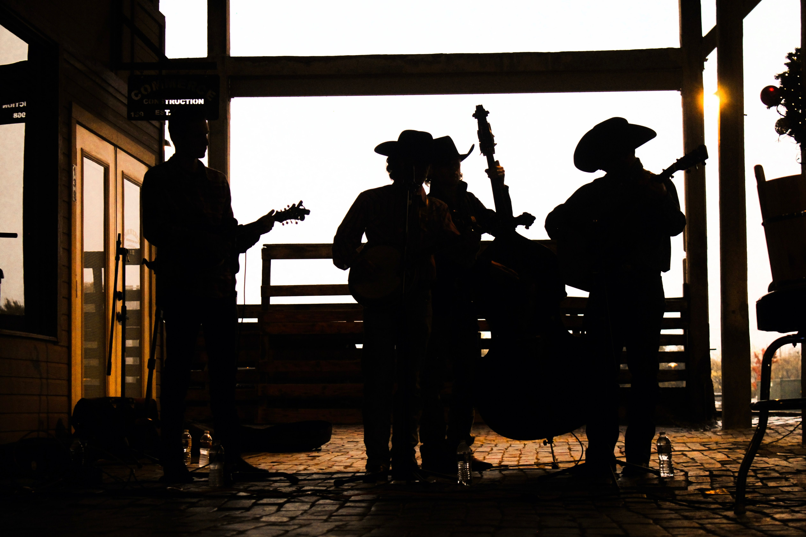

# Country Music Lyrics & Network Analysis (2013–2019)

<!-- Hero Image Placeholder -->

## Project Overview
This project explores the landscape of country music between 2013 and 2019 by analyzing song lyrics, chart performance, and the underlying collaborative networks of the genre's top creators. By parsing text data and mapping collaboration frequencies, this analysis highlights the top songwriters and producers driving the industry's hits.

## Objectives
*   **Text Processing:** Parse and analyze country music lyrics to extract thematic trends.
*   **Performance Tracking:** Analyze chart performance metrics to identify the most successful tracks and artists of the era.
*   **Network Analysis:** Visualize collaboration networks between songwriters, producers, and performing artists.

## Tools & Technologies
*   **Language:** Python
*   **Data Processing:** Pandas, NumPy
*   **Text Analysis:** Python String Parsing, Regular Expressions
*   **Visualization:** Matplotlib, Seaborn

## View the Notebook
The dataset and full analysis pipeline are hosted on Kaggle. You can review the diagnostic research, text parsing logic, and generated network visualizations by visiting the interactive notebook:

**[Explore the complete Kaggle Notebook here](https://www.kaggle.com/code/arnoldaijuka/arnold-aijuka-country-music-dataset-cs-da03-26044)**
